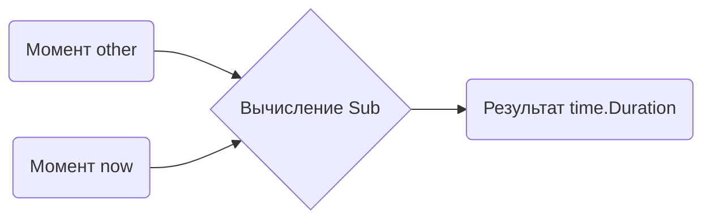

В Go разницу между двумя моментами времени можно вычислить с помощью метода `Sub` структуры `time.Time`. Вызов `time.Now().Sub(other)` возвращает значение типа `time.Duration`, которое показывает, сколько прошло от точки `other` до текущего времени. Это удобно для измерения интервалов, работы с тайм-аутами или логирования задержек.  

Если нужно изобразить это схематично, можно представить так:  



```old
// diff := time.Now().Sub(other) - разница между двумя временами
```