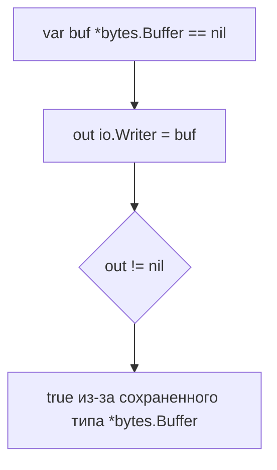

В Go интерфейсы могут хранить одновременно значение и его тип. Если в функцию с параметром типа `io.Writer` передать переменную `var buf *bytes.Buffer`, то это будет не совсем `nil`, а интерфейс, в котором записан конкретный тип `*bytes.Buffer` со значением `nil`. В результате проверка `if out != nil` вернет `true`, хотя сам `buf` фактически пуст. Это часто становится источником неочевидных ошибок, так как программист ожидает, что условие не выполнится.  

Чтобы избежать этой ловушки, нужно или явно проверять на nil указатель до оборачивания в интерфейс, или использовать дополнительные условия типа приведения, или же проверять через отражение. Проще всего — следить, что в интерфейс не передаются «типизированные nil», инициализировать объекты сразу или использовать корректные nil-интерфейсы.  

```go
func fn(out io.Writer) {
    if out != nil {
        // Вызовется даже если out содержит (*bytes.Buffer)(nil)
    }
}
```



```old
// func fn(out io.Writer) { if out != nil { ... } } - потенциальная ошибка, если передать типизированный nil, например var buf *bytes.Buffer
```