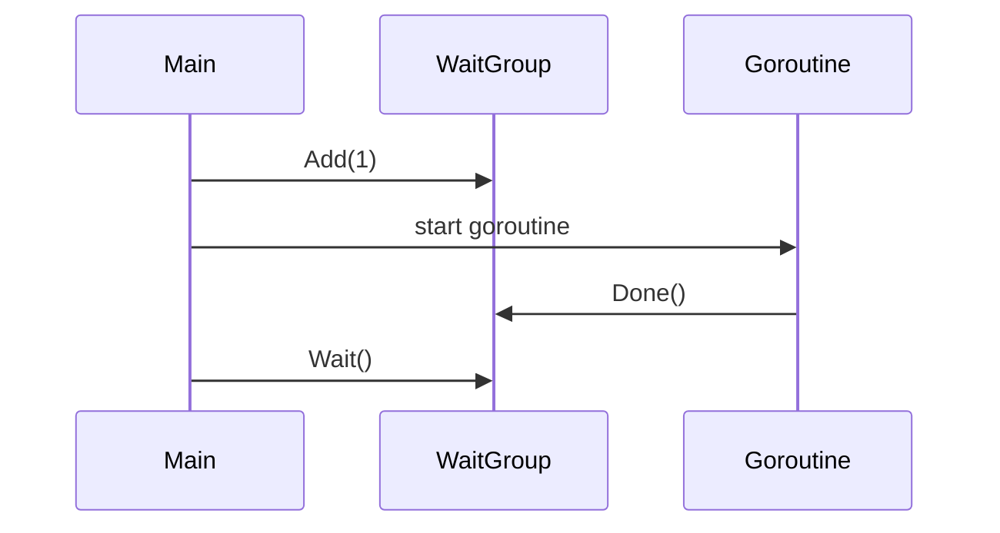

Секрет в том, что метод `wg.Add(1)` должен вызываться строго до запуска горутины и в том же потокe, где будет вызван `wg.Wait()`. Иначе есть риск, что `Wait()` начнет отсчитывать завершение работ раньше, чем зарегистрируется новая горутина, и в итоге она может никогда не быть учтена — это приведет либо к преждевременному завершению программы, либо к дедлоку. То есть порядок таков: сначала увеличить счетчик (`Add`), потом запустить горутину, и только после — ожидать завершения через `Wait()`.  

Диаграмму можно представить так:  



```old
// важно запускать wg.Add(1) в том же потоке (или родительском), где и wg.Wait()
```